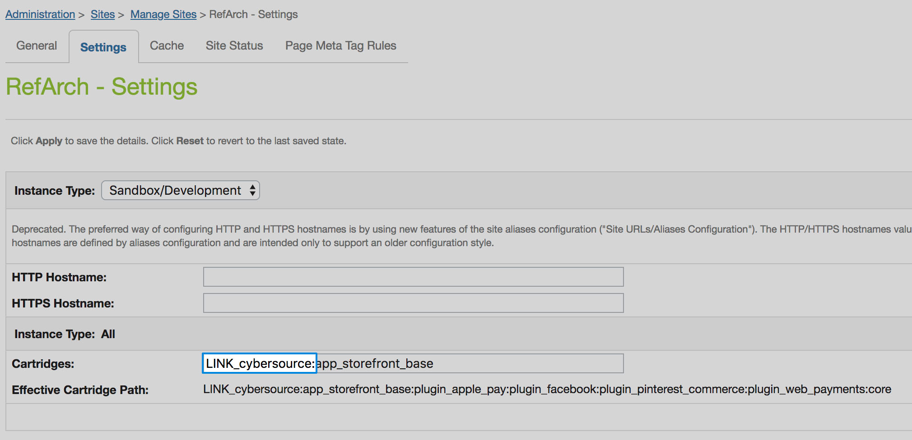
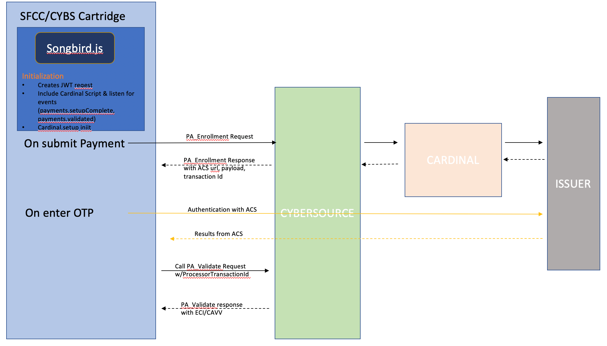

## CyberSource Storefront Reference Architecture  ##
## LINK Cartridge 3DS2.X - Developer Guide ##

* **Version:** Upgrading from Version 19.2.X to Version 19.3.0
* **Comatibility:** <span style="color:red">This version of the Cybersource cartridge is not compatible with versions of SFRA higher than Release 3.2.0.  </span>
This version can be found on the Master branch of the SFRA repository at commit 492db3acd7d554212d8d881ca816fb60ecab6dd3 [492db3a] on August 1st  2018.
* **Overview:** The CyberSource package contains four cartridges.  A core cartridge (**int_cybersource**) that contains core API integrations, including the building and handling of API requests, and parsing responses into objects usable by the storefront.  The two legacy architecture cartridges (**int_cybersource_pipelines, int_cybersource_controllers**) each contain sets of wrappers that connect the core code to their respective SFCC platforms.  If you are integrating CyberSource with a controller or pipeline version of Site Genesis, please disregard this document, and refer to the corresponding integration guide for your version of Site Genesis.
Version 18.1 and higher of the CyberSource cartridge package adds a fourth cartridge (**int_cybersource_sfra/ LINK_cybersource**), which combines a modified version of the core code that exists in the int_cybersource, along with the necessary hooks, extensions, and wrappers to connect this code to the SFRA storefront.  When integrating CyberSource with SFRA, you should only upload the LINK_cybersource cartridge to your workspace and storefront.  The remaining three cartridges are not utilized in this integration and can be ignored.  The following pages describe the high-level architecture of the SFRA CS Architecture, along with details regarding specific Integrations.

#### Installation Guide ####

**1. Workspace Preparation**
Out of the box, this cartridge (int_cybersource_sfra) assumes it has been placed in the same directory as the storefront-reference-architecture folder.  If you have a different project set-up, you will need to open the file ‘int_cybersource_sfra/package.json’ and modify the paths.base value to point to your ‘app_storefront_base’ cartridge.  This path is used by the JS and SCSS build scripts.  Once complete, follow the below steps.

1.	On your terminal, navigate to int_cybersource_sfra
2.	If you have not already, install node using ‘nvm install node’
3.	Run ‘npm install’ to install all of the local dependencies.
4.	If using Eclipse, add the ‘Link_cybersource cartridge to your workspace.
5.	If using Visual Studio Code, do the following:
a.	Create the file `dw.json` under the int_cybersource_sfra folder with contents:
```{
    "hostname": "your-sandbox-hostname.demandware.net",
    "username": "yourlogin",
    "password": "yourpwd",
    "version": "version_to_upload_to",
    "cartridge": [
        "LINK_cybersource",
        "app_storefront_base",
        "modules"
    ]
}
```
Note: Configuration of this file, and the cartridges you want uploaded and watched will depend on your project.
b.	Run `npm run uploadCartridge` command to upload cartridges defined in dw.json to the server defined in dw.json.
6.	Run `npm run compile:scss` to compiles all .scss files into CSS.
7.	Run `npm run compile:js` - Compiles all .js files and aggregates them.
8.	If using Eclipse, refresh your project contents, as new JS and css files may have been created, that need to be uploaded.  To avoid doing this every time you compile your JS or SCSS, Enable the Workspace Preference ".

Note: If you have trouble getting your build scripts to run, or encounter errors in your npm install, try setting your node version to 8.11.3 and go back to step 3.

**2. Cartridge Installation**
Whether installing the cartridge for the first time, or upgrading to a new version, perform the following steps to ensure you have the latest metadata.
After following the above steps, the LINK_cybersource cartridge should be uploaded to your SFCC instance, to the active code version.  Follow the steps below to configure your server for the LINK_cybersource cartridge.
1.	In Business Manager, navigate to ‘Administration >  Sites >  Manage Sites > Your Site’ and select the ‘Settings’ tab.  
2.	Add ‘LINK_cybersource:’ to the left side of the cartridge path, before ‘app_storefront_base’



3.	Navigate to ‘Administration >  Site Development >  Import & Export’.
4.	Upload and import the meta data file:
- int_cybersource_sfra/configuration/CS SFRA Metadata v19_3.xml
5.	Basic cartridge installation is complete.  Reference the ‘Usage’ and ‘Configuration’ guides on the following pages for activation and configuration of individual services.  Some services will require importing additional data files to your sandbox.  Instructions to do so are included those specific services ‘Usage’ sections.

**3. Payer Authentication**
###### Integration Overview ######
The CyberSource LINK Cartridge 19.3.0 provides support for the latest 3D Secure 2.x specification.  Upgrading your Payer Authentication integration from the legacy 3D Secure 1.0 specification to 2.x will allow for better authentication rates from issuers and meet PSD2 regulatory requirements for Strong Customer Authentication (SCA) in Europe.

The following is a high level architectural diagram of how the Payer Authentication integration works:



###### Implementation for upgrade to 3DS2.x ######
To enable Payer Authentication services on SFRA, ensure you have followed all steps in the "Cartridge Installation" guide above.  A CyberSource Merchant ID, CyberSource Merchant Key and CyberSource PA Merchant ID are required for CyberSource Payer Authentication Enrollment and Payer Authentication Validate. Along with these, the Cruise credentials ApiIdentifier, ApiKey, OrgUnitID and Merchant Name are needed.   Enter these values in the corresponding Site Preferences under the "CyberSource: Core" group and work with CyberSource to ensure required credit card types are configured on your account.
Import Payment methods – Already covered in section Credit Card Authorization, this section is included for reference
1.	Import ‘int_cybersource_sfra/configuration/CS SFRA PaymentMethods v19_3.xml’, ‘configuration/PayerAuth-Meta.xml’ into your sandbox.
2.	Under 'Merchant Tools >  Ordering >  Payment Methods' Make sure the 'CREDIT_CARD' payment method is enabled and configured to use the CYBERSOURCE_CREDIT payment processor.
3.	On the same page, select 'Credit/Debit cards' and check the payer authentication checkbox on any credit card types you want to support Payer Authentication.

###### Configuration ######
Under 'Merchant Tools > Ordering >  Payment Methods, select ‘Credit/Debit cards’. Select each credit card as needed and ensure custom-attribute ‘Enable Payer Authentication’ checkbox is checked.

Site Preference Group: CyberSource Core
Preference Name | Usage
------------ | -------------
CS PA Merchant ID | Payer Auth merchant ID
CS PA Save Proof.xml | To enable/disable saving of proof.xml in order object
CS PA Save ParesStatus | Default False <br> Save ParesStatus received as response from Pa Authenticate request and send it as param in ccAuth request call. This field should be enabled after verifying cybersource merchant account settings

[SFRA ChangeLog](SFRA-ChangeLog.xlsx)


