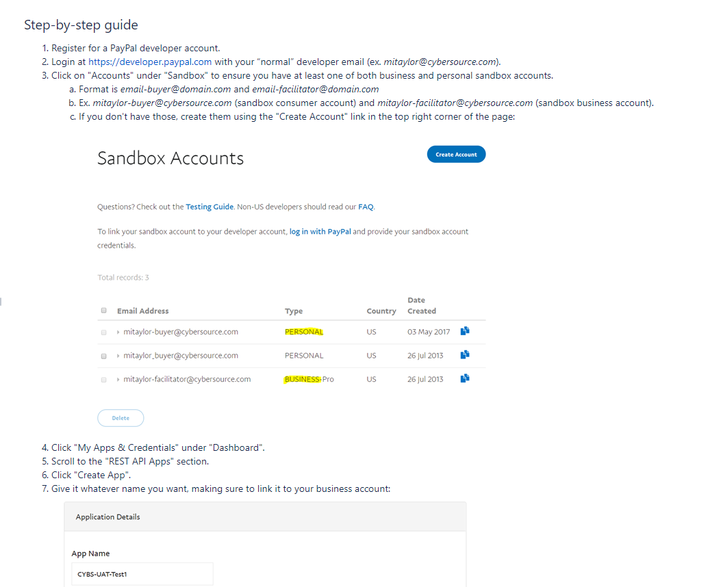
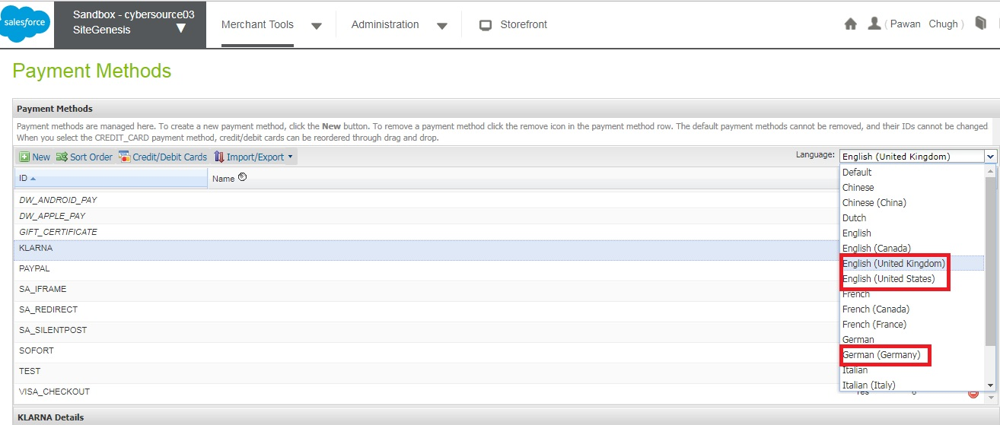
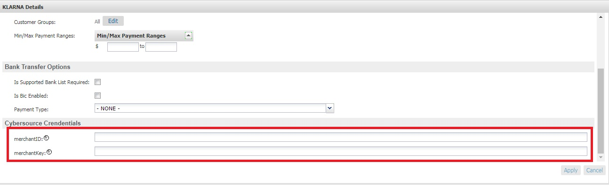

## <ins>Configure Payment Methods

### Payment Methods ###
 1. [Credit Card Authorization](Configure-payment-method.md#1-credit-card-authorization)
   1.1. Secure Acceptance Hosted Checkout – iFrame
   1.2. Secure Acceptance Redirect
   1.3. Secure Acceptance Checkout API
   1.4. Secure Acceptance Flex MicroForm
   1.5. Direct Cybersource SOAP API
 2. [Apple Pay](Configure-payment-method.md#2-apple-pay)
 3. [PayPal](Configure-payment-method.md#3-PayPal)
 4. [Google Pay](Configure-payment-method.md#4-Google-Pay)
 5. [Visa Checkout](Configure-payment-method.md#5-Visa-Checkout)
 6. [Bank Transfer](Configure-payment-method.md#6-Bank-Transfer)
 7. [Alipay](Configure-payment-method.md#7-Alipay)
 8. [Klarna](Configure-payment-method.md#8-Klarna)
 9. [WeChat Pay](Configure-payment-method.md#9-WeChat-Pay)

---

### **1. Credit Card Authorization**
 ##### Overview
 The CC Auth service is integrated via the SFRA OOTB dynamically generated app.payment.processor.cybersource_credit hook.  The cybersource_credit hook is registered in the hooks.json file with script ./cartridge/scripts/hooks/payment/processor/cybersource_credit.  This script acts as a wrapper to the core CyberSource Authorization code.  Behind this wrapper, an API request is constructed, sent to CS, and the response parsed.  In the case of a successful authorization (response code 100), the hook returns a JSON object without an error.  All other response codes received result in an error being present in the return object, triggering the storefront to display an error message, and not create the order.  Actions taken when making the Authorization call are as follows:
 1)	Creates CyberSource authorization request using ship-to, bill-to, credit card data, and purchase total data from the current basket.  
 2)	If authorize Payer is configured, then make the authorize payer request.  If not, ignore and continue with the authorization request.
 3)	Create a credit card authorization request.
 4)	If DAV is enabled, set up DAV business rules, as needed.
 5)	Set up AVS if enabled.
 6)	Make the service call to CyberSource via the SOAP API.
 7)	If Delivery Address Verification is enabled, then:
 a.	Capture pertinent DAV result information & DAV Reason Code.  Update shipping address if a suggestion was returned and the ‘CS DAV Update Shipping Address With DAV Suggestion’ site preference is enabled.
 b.	If DAV fails and DAV On Failure is set to ‘REJECT’, then exit immediately with rejection response
 8)	If DAV On Failure is set to ‘APPROVE’ and the DAV Reason Code is a fail code (not 100), then:
 a.	Exit immediately with declined or review response, as merchant defines
 9)	Capture pertinent AVS information.
 10)	Capture Fraud response in a session variable to be handled later.
 11)	Validate authorization reason code and set corresponding values, based on Auth response code.

##### Implementation
 Cybersource Cartridge supports the following ways of processing Credit Card
    a. Secure Acceptance Hosted Checkout – iFrame
    b. Secure Acceptance Redirect
    c. Secure Acceptance Checkout API
    d. Secure Acceptance Flex MicroForm
    e. Direct Cybersource Payment API

 **Prerequsite**

 In the Business Manager, go to **Merchant Tools > Ordering > Payment Methods** and select **CREDIT_CARD**. And in **CREDIT_CARD details**, double check if **Payment Processor** = **"CYBERSOURCE_CREDIT"**

#### <ins>1.1. To Setup Secure Acceptance Hosted Checkout – iFrame
 Step 1: Upload Cybersource metadata in Business Manager. If not follow ["Step 2: Upload metadata"](Configure-cartridge.md#step-2-upload-metadata) or import **"metadata/sfra_meta/meta/Cybersource_SecureAcceptance.xml"** in Business Manager (**Administration > Site Development > Import & Export**)

 Step 2: Go to **Merchant Tools > Site Preferences > Custom Preferences > Cybersource_SecureAcceptance** and set values for the parameter:

 | Field                       | Description                                             | Value to Set  |
 | --------------------------- | ------------------------------------------------------- | ------------- |
 | CsSAType                    | Secure Acceptance Type                                  | **SA_IFRAME** |
 | SA_Iframe_ProfileID         | Secure Acceptance Iframe Profile ID. Follow **"Creating a Hosted Checkout Profile"** step from SA Guide [url](https://developer.cybersource.com/library/documentation/dev_guides/Secure_Acceptance_Hosted_Checkout/Secure_Acceptance_Hosted_Checkout.pdf)                    |
 | SA_Iframe_SecretKey         | Secure Acceptance Iframe secret key. Follow this [link](https://support.cybersource.com/s/article/How-to-Create-or-Update-a-Secure-Acceptance-security-key)                     |
 | SA_Iframe_AccessKey         | Secure Acceptance Iframe Access Key. Get access key from above step                    |
 | CsSAIframetFormAction       | CyberSource secure acceptance Iframe form action        |
 | CsSAOverrideBillingAddress  | CyberSource Secure Acceptance Override Billing Address  |
 | CsSAOverrideShippingAddress | CyberSource Secure Acceptance Override Shipping Address |
 | CsCvnDeclineFlags           | CyberSource Ignore CVN Result (CVN)                     |

#### <ins>1.2. To Setup Secure Acceptance Redirect
 Step 1: Upload Cybersource metadata in Business Manager. If not follow ["Step 2: Upload metadata"](Configure-cartridge.md#step-2-upload-metadata) or import **"metadata/sfra_meta/meta/Cybersource_SecureAcceptance.xml"** in Business Manager (**Administration > Site Development > Import & Export**)

 Step 2: Go to **Merchant Tools >  Site Preferences > Custom Preferences > Cybersource_SecureAcceptance** and set values for the parameter:

 | Field                       | Description                                              | Value to Set    |
 | --------------------------- | -------------------------------------------------------- | --------------- |
 | CsSAType                    | Secure Acceptance Type                                   | **SA_REDIRECT** |
 | SA_Redirect_ProfileID       | Secure Acceptance Redirect Profile ID. Follow **"Creating a Hosted Checkout Profile"** step from SA Guide [url](https://developer.cybersource.com/library/documentation/dev_guides/Secure_Acceptance_Hosted_Checkout/Secure_Acceptance_Hosted_Checkout.pdf)                  |
 | SA_Redirect_SecretKey       | Secure Acceptance Redirect Secret Key. Follow this [link](https://support.cybersource.com/s/article/How-to-Create-or-Update-a-Secure-Acceptance-security-key)                   |
 | SA_Redirect_AccessKey       | Secure Acceptance Redirect Access Key. Get acess key from above step                    |
 | CsSARedirectFormAction      | CyberSource secure acceptance redirect form action.      |
 | CsSAOverrideBillingAddress  | CyberSource Secure Acceptance Override Billing Address.  |
 | CsSAOverrideShippingAddress | CyberSource Secure Acceptance Override Shipping Address. |
 | CsCvnDeclineFlags           | CyberSource Ignore CVN Result (CVN).                     |

#### <ins>1.3. To Setup Secure Acceptance Checkout API
 Step 1: Upload Cybersource metadata in Business Manager. If not follow ["Step 2: Upload metadata"](Configure-cartridge.md#step-2-upload-metadata) or import **"metadata/sfra_meta/meta/Cybersource_SecureAcceptance.xml"** in Business Manager (**Administration > Site Development > Import & Export**)

 Step 2: Go to **Merchant Tools > Site Preferences > Custom Preferences > Cybersource_SecureAcceptance** and set values for the parameter:

 | Field                                   | Description                                              | Value to Set      |
 | --------------------------------------- | -------------------------------------------------------- | ----------------- |
 | CsSAType                                | Secure Acceptance Type                                   | **SA_SILENTPOST** |
 | SA_Silent_ProfileID                     | Secure Acceptance Silent Post Profile ID. Follow **"Creating Checkout API Profile"** section from this [link](https://developer.cybersource.com/library/documentation/dev_guides/Secure_Acceptance_Checkout_API/Secure_Acceptance_Checkout_API.pdf)               |
 | SA_Silent_SecretKey                     | Secure Acceptance Silent Post Secret Key. Follow this [link](https://support.cybersource.com/s/article/How-to-Create-or-Update-a-Secure-Acceptance-security-key)               |
 | SA_Silent_AccessKey                     | Secure Acceptance Silent Post Access Key. Get access key from above step               |
 | Secure_Acceptance_Token_Create_Endpoint | Secure_Acceptance_Token_Create_Endpoint.                 |
 | Secure_Acceptance_Token_Update_Endpoint | Secure_Acceptance_Token_Update_Endpoint.                 |
 | CsSAOverrideBillingAddress              | CyberSource Secure Acceptance Override Billing Address.  |
 | CsSAOverrideShippingAddress             | CyberSource Secure Acceptance Override Shipping Address. |
 | CsCvnDeclineFlags                       | CyberSource Ignore CVN Result (CVN).                     |

#### <ins>1.4. To Setup Secure Acceptance Flex MicroForm

 **Prerequisites:** You will also need to create an [API Key and API Shared Secret Key](https://developer.cybersource.com/api/developer-guides/dita-gettingstarted/authentication/createSharedKey.html) that you can use to authenticate requests to our sandbox. Follow same steps to generate Production key and shared secret.

 Step 1 a: In Business Manager, go to Administration > Operations > Services and click on the ‘CybersourceFlexToken’ Credentials.  Ensure the appropriate URL is set for the environment you are configuring.
	-   Test: https://apitest.cybersource.com/microform/v2/sessions?format=JWT 
    -	Production: https://api.cybersource.com/microform/v2/sessions?format=JWT   

 Step 1 b: Navigate to Administration > Operations > Services and click on the ‘AssymentricKeyManagement’  Credentials. Ensure the appropriate URL is set for the environment you are  configuring: 
   Test: https://apitest.cybersource.com/flex/v2/public-keys 
   Production: https://api.cybersource.com/flex/v2/public-keys 

 Step 2: Upload Cybersource metadata in Business Manager. If not follow ["Step 2: Upload metadata"](Configure-cartridge.md#step-2-upload-metadata) or import **"metadata/sfra_meta/meta/Cybersource_SecureAcceptance.xml"** in Business Manager (**Administration > Site Development > Import & Export**)

 Step 3: Go to **Merchant Tools > Site Preferences > Custom Preferences > Cybersource_SecureAcceptance** and set values for the parameter:

 | Field                | Description                                                                                                                                                            | Value to Set |
 | -------------------- | ---------------------------------------------------------------------------------------------------------------------------------------------------------------------- | ------------ |
 | CsSAType             | Secure Acceptance Type                                                                                                                                                 | **SA_FLEX**  |
 | SA_Flex_HostName     | Test: apitest.cybersource.com Production: api.cybersource.com.com                                                                                                       |
 | SA_Flex_KeyID        | Flex Microform Key ID. Follow [link](https://developer.cybersource.com/api/developer-guides/dita-gettingstarted/authentication/createSharedKey.html) to generate keys. |
 | SA_Flex_SharedSecret | Flex Microform Shared Secret                                                                                                                                      
 SA_Flex_AllowedCardNetworks      |   Configure card types for Cybersource Flex Microform | VISA  MASTER DISCOVER  DINERSCLUB JCB MAESTRO AMEX CUP JCREW CARTESBANCAIRES ELO 

 Step 4: Navigate to ‘**Administration > Global Preferences >  Locales**’ and ensure the local ‘en_US’ is present. If not present, create a new local with the following information:
 - Language Code: en 
 - Country Code: US
 - XML Code: en-US
 - ISO-3 Language: eng
 - ISO-3 Country: USA
 - Fallback Locale: English(en) 

 Once present, select the ‘en_US’ local, and navigate to the ‘Regional Settings’ tab. In the ‘Long Date Pattern’ field, enter the sting: EEE, dd MMM yyyy HH:mm:ss z

#### <ins>1.5. To Setup Direct Cybersource SOAP API

 Step 1: Upload Cybersource metadata in Business Manager. If not follow ["Step 2: Upload metadata"](Configure-cartridge.md#step-2-upload-metadata) or import **"metadata/sfra_meta/meta/Cybersource_SecureAcceptance.xml"** in Business Manager (**Administration > Site Development > Import & Export**)

 Step 2: Go to **Merchant Tools > Site Preferences > Custom Preferences > Cybersource_SecureAcceptance** and set values for the parameter:

 | Field                          | Description                 | Value to Set |
 | -------- | ---------------------- | ------------ |
 | CsSAType |                 Secure Acceptance Type |            **None**     |

---

#### <ins>Payer Authentication (3D Secure)

**Prerequisite**
 - Please contact your Cybersource Representative to sign up and receive your Payer Authentication credentials.
  
 - Go to **Merchant Tools > Ordering > Payment Methods**, select 'Credit/Debit cards' and check the payer authentication checkbox on any credit card types you want to support Payer Authentication.

###### Upgrade to 3DS2.0
If you are currently using CYBS cartridge and would like to upgrade to 3DS2.0, please refer below doc:
[3DS2.x Dev Guide for SFRA](3DS2x-Dev-Guide-for-SFRA.md)

------------------------------------------------------------------

###### Strong Customer Authentication 

If response code 478 is received, the issuer is declining the authorisation request but advising that if the card holder gets SCA’d, the issuer will approve the authorisation.

Proposed Approach:
Automatically retry the transaction adding Payer Auth Mandate Challenge (code 04) to force cardholder SCA challenge. This flow should appear seamless to the card holder

Site Preferences:

  Step 1: Upload Cybersource metadata in Business Manager. If not follow ["Step 2: Upload metadata"](Configure-cartridge.md#step-2-upload-metadata) or import **"metadata/sfra_meta/meta/PayerAuthentication.xml"** in Business Manager (**Administration > Site Development > Import & Export**)

  Step 2: Go to Merchant Tools > Site Preferences > Custom Preferences > Cybersource_PayerAuthentication and set values for the following parameters:
  |Field	       |       | Description                           |
  | IsSCAEnabled	 |       | Enable Strong Customer Authentication |

Set the value for IsSCAEnabled to yes to use Strong Customer Authentication feature.

---------------------------------------------------
### **2. Apple Pay**

#### <ins>Step 1: Create a merchant identifier in Apple portal:

 A merchant identifier uniquely identifies you to Apple Pay as a merchant who is able to accept payments. You can use the same merchant identifier for multiple native and web apps. It never expires.

  1. Go to Apple portal : https://help.apple.com/developer-account/#/devb2e62b839?sub=dev103e030bb

  2. In Certificates, Identifiers & Profiles, select Identifiers from the sidebar, then click the Add button (+) in the upper-left corner.

  3. Select Merchant IDs, then click Continue.

  4. Enter the merchant description and identifier name, then click Continue.

  5. Review the settings, then click Register.

  #### <ins>Step 2: Enrolling in Apple Pay in Cybersource

 To enroll in Apple Pay:

  1. Log in to the Business Center:
   - Test: [link](https://ebctest.cybersource.com/ebc2/)
   - Live: [link](https://ebc2.cybersource.com/ebc2/)

  2. On the left navigation pane, click the **Payment Configuration** icon.

  3. Click **Digital Payment Solutions**. The Digital Payments page appears.

  4. Click **Configure**. The Apple Pay Registration panel opens.

  5. Enter your Apple Merchant ID. (Created in Step 1.4)

  6. Click **Generate New CSR**.

  7. To download your CSR, click the **Download** icon next to the key.

  8. Follow your browser's instructions to save and open the file.

 #### <ins>Step 3 : Complete the enrollment process by submitting your CSR to Apple

 Create a payment processing certificate:
 A payment processing certificate is associated with your merchant identifier and used to encrypt payment information. The payment processing certificate expires every 25 months. If the certificate is revoked, you can recreate it.

  1. In Certificates, Identifiers & Profiles, select Identifiers from the sidebar.

  2. Under Identifiers, select Merchant IDs using the filter in the top-right.

  3. On the right, select your merchant identifier.
     Note: If a banner appears at the top of the page saying that you need to accept an agreement, click the Review Agreement button and follow the instructions before continuing.

  4. Under Apple Pay Payment Processing Certificate, click Create Certificate.

  5. Click Choose File.

  6. In the dialog that appears, select the CSR file downloaded from Step 2.7, then click Choose.

  7. Click Continue.

 #### <ins>Step 4:  Configure Apple Pay in SFCC Business Manager

 Business Manager Configuration

  1. Go to: **“Merchant Tools > Site Preferences > Apple pay**

  2. Check “Apple Pay Enabled?”

  3. Fill in the “Onboarding” form:

   - Ensure “Apple Merchant ID” and “Apple Merchant Name” match settings in your Apple account

   - Ensure all other fields match the your supported Cybersource settings

  4. Fill in the “Storefront Injection” form:

   - Selects where Apple Pay buttons should be displayed on your site.

  5. Fill in “Payment Integration” form:

   - Leave all form fields blank

   - Ensure “Use Basic Authorization” is checked
   6. Click "Submit"

   #### <ins>Step 5: Domain Registration in SFCC Business Manager

   1. Go to: **“Merchant Tools > Site Preferences > Apple Pay**
   2. Under **Domain Registration** section
      a. Click on **Register Apple Sandbox** under Apple Sandbox section for registering SFCC to Apple Sandbox account.
      b. Click on **Register Apple Production** under Apple Production section for registering SFCC to Apple Production account.

   #### <ins>Step 6: Payment Processor
   1. In the Business Manager, go to **Merchant Tools > Ordering > Payment Methods** and select **DW_APPLE_PAY**. And in **DW_APPLE_PAY details**, double check if **Payment Processor** = **"CYBERSOURCE_CREDIT"**

    #### <ins>Site Preferences:
   Step 1: Upload Cybersource metadata in Business Manager. If not follow ["Step 2: Upload metadata"](Configure-cartridge.md#step-2-upload-metadata) or import **"metadata/sfra_meta/meta/ApplePay.xml"** in Business Manager (**Administration > Site Development > Import & Export**)

   Step 3: Go to **Merchant Tools > Site Preferences > Custom Preferences > Apple Pay**
   and set values for the following parameters:

   Field | Description
   ------------ | -------------
   ApplePayTransactionType | Select Sale/Auth transaction type

----

### **3. PayPal**

##### Implementation

Cybersource Cartridge supports the following for PayPal:
a. PayPal Express
b. PayPal Credit
c. PayPal Billing Agreement

**Prerequsite**

Prior to development phase, there are a generic set of configurations that a development team needs to account for. These configurations include:
1) [PayPal developer account](https://developer.paypal.com/docs/api/sandbox/create-paypal-dev-account/)

2) [PayPal sandbox account](https://developer.paypal.com/docs/api-basics/sandbox/accounts/)
Screenshot of the detailed set of configurations for #1 & #2

3) Linking developer and sandbox account. On creating a PayPal developer account, get in touch with the CyberSource team, share the developer account details and get the developers’ details configured on CyberSource (BackOffice Configuration tool).
Share the following keys with Cybersource:
•	ClientID (paypalgateway_client_key) - Follow this [link](https:/www.paypal.com/us/smarthelp/article/how-do-i-create-rest-api-credentials-ts1949) to generate.
•	Secret (paypalgateway_secret_phrase) - Follow this [link](https:/www.paypal.com/us/smarthelp/article/how-do-i-create-rest-api-credentials-ts1949) to generate.
•	Merchant Account ID (paypalgateway_mid) – Follow this [link](https://www.paypal.com/us/smarthelp/article/FAQ3850) to generate.
•	Merchant email (paypalgateway_merchant_email) - Follow this [link](https://www.paypal.com/us/smarthelp/article/FAQ3850) to generate.

#### <ins>a. To setup PayPal Express

Step 1: Upload Cybersource metadata in Business Manager. If not follow ["Step 2: Upload metadata"](Configure-cartridge.md#step-2-upload-metadata) or import **"metadata/sfra_meta/meta/Cybersource_Paypal.xml"** in Business Manager (**Administration > Site Development > Import & Export**).

Step 2: Go to **Merchant Tools > Site Preferences > Custom Preferences > Cybersource_Paypal** and set values for the parameter:

| FIeld                 | Description                                                                                                                        |
| --------------------- | ---------------------------------------------------------------------------------------------------------------------------------- |
| CsEnableExpressPaypal | Effectively enables or disables the PayPal Express checkout.                                                                       |
| Paypal Order Type     | The type of authorization to follow for PayPal orders. Select STANDARD for Authorize & Capture or select CUSTOM for just Authorize |

#### <ins>b. To setup PayPal Credit

Step 1: Upload Cybersource metadata in Business Manager. If not follow ["Step 2: Upload metadata"](Configure-cartridge.md#step-2-upload-metadata) or import **"metadata/sfra_meta/meta/Cybersource_Paypal.xml"** in Business Manager (Administration > Site Development > Import & Export).

Step 2: Go to **Merchant Tools > Site Preferences > Custom Preferences > Cybersource_Paypal** and set values for the parameter:

| Field             | Description                                                                                                                        |
| ----------------- | ---------------------------------------------------------------------------------------------------------------------------------- |
| Paypal Order Type | The type of authorization to follow for PayPal orders. Select STANDARD for Authorize & Capture or select CUSTOM for just Authorize |
|Paypal Address Override |	If this set to true , then address of buyer will be override by the shipping address provided in shipping page |

#### <ins>c. To setup PayPal Billing Agreement

Step 1: Upload Cybersource metadata in Business Manager. If not follow ["Step 2: Upload metadata"](Configure-cartridge.md#step-2-upload-metadata) or import **"metadata/sfra_meta/meta/Cybersource_Paypal.xml"** in Business Manager (**Administration > Site Development > Import & Export**).

Step 2: Go to **Merchant Tools > Site Preferences > Custom Preferences > Cybersource_Paypal** and set values for the parameter:

| Field             | Description                                                                                                                        |
| ----------------- | ---------------------------------------------------------------------------------------------------------------------------------- |
| Billing Agreement | Effectively enables or disables the PayPal Billing Agreement.                                                                      |
| Paypal Order Type | The type of authorization to follow for PayPal orders. Select STANDARD for Authorize & Capture or select CUSTOM for just Authorize |

#### <ins>d. To setup Decision Manager for PayPal 

Refer to this [link](https://www.cybersource.com/en-us/solutions/fraud-and-risk-management/decision-manager.html) if you want to setup Decision Manager feature for PayPal transactions.
Go to Merchant Tools > Site Preferences > Custom Preferences > Cybersource: Decision Manager Configuration and set values for the parameter:

| Field                              | Description                                                                  |
| ---------------------------------- | ---------------------------------------------------------------------------- |
| Decision Manager Enable for Paypal | Enable or disable Decision Manager for PayPal transactions.                  |

### **4. Google Pay**

##### Implementation

**Prerequisite:**

Before proceeding to BM configuration, a Merchant Account needs to be created with Google. Please follow the [link](https://support.google.com/paymentscenter/answer/7161426?hl=en) to create the merchant account with google.

Step 1: Upload Cybersource metadata in Business Manager. If not follow ["Step 2: Upload metadata"](Configure-cartridge.md#step-2-upload-metadata) or import **"metadata/sfra_meta/meta/Cybersource_GooglePay.xml"** in Business Manager (**Administration > Site Development > Import & Export**).

Step 2: Go to **Merchant Tools > Site Preferences > Custom Preferences > Cybersource_GooglePay** and set values for the parameter:

| Field                      | Description                          |
| -------------------------- | ------------------------------------ |
| enableGooglePay            | Enable or Disable Google Pay Service |
| googlePayMerchantID        | Cybersource Merchant account ID      |
| googlePaygatewayMerchantId | Matching setting on Google Account   |
| googlePayTransactionType   |  Select Sale/Auth transaction Type   |

### **5. Visa Checkout**

##### Implementation

**Prerequisite:**

1. To complete the checkout process successfully create Visa Checkout profile ([link])(https://developer.cybersource.com/library/documentation/dev_guides/Business_Center/html/ebc2_olh/PaymentConfiguration/DigitalPaymentSolutions/enabling_visa_checkout.html) on CyberSource business center console under '**Account Management > Digital Payment Solutions > Profiles > Enable Visa Checkout**'.
2. Click profile tab and add profile, configure all the mandatory settings, also use API Key from Setting Tab.
3. Create Secret key from ‘**Account Management > Client Integration Management > Payment Configuration > Key Management**’. Click Generate key and select shared secret.

Step 1: Upload Cybersource metadata in Business Manager. If not follow ["Step 2: Upload metadata"](Configure-cartridge.md#step-2-upload-metadata) or import **"metadata/sfra_meta/meta/Cybersource_VisaCheckout.xml"** in Business Manager (**Administration > Site Development > Import & Export**).

Step 2: Go to **Merchant Tools > Site Preferences > Custom Preferences > Cybersource_VisaCheckout** and set values for the parameter:

| Field                           | Description                                                                                                                                                                                                                                                                                 |
| ------------------------------- | ------------------------------------------------------------------------------------------------------------------------------------------------------------------------------------------------------------------------------------------------------------------------------------------- |
| cybVisaSdkJsLibrary             | Sandbox: https://sandbox-assets.secure.checkout.visa.com/checkout-widget/resources/js/integration/v1/sdk.js  LIVE: https://assets.secure.checkout.visa.com/checkout-widget/resources/js/integration/v1/sdk.js                                                                            |
| cybVisaTellMeMoreLinkActive     | Indicate whether Tell Me More Link to be displayed with VISA button true (default) false                                                                                                                                                                                                    |
| cybVisaButtonColor              | The color of the Visa Checkout button. standard or neutral.                                                                                                                                                                                                                                 |
| cybVisaButtonSize               | The size of the Visa Checkout button                                                                                                                                                                                                                                                        |
| cybVisaButtonHeight             | The height of the Visa Checkout button in pixels.                                                                                                                                                                                                                                           |
| cybVisaButtonImgUrl             | Sandbox: https://sandbox.secure.checkout.visa.com/wallet-services-web/xo/button.png   LIVE: https://secure.checkout.visa.com/wallet-services-web/xo/button.png                                        |
| cybVisaCardBrands               | Brands associated with card art to be displayed                                                                                                                                                                                                                                             |
| cybVisaButtonWidth              | The width of the Visa Checkout button in pixels.                                                                                                                                                                                                                                            |
| cybVisaThreeDSSuppressChallenge | Whether a Verified by Visa (VbV) consumer authentication prompt is suppressed for this transaction. If true, VbV authentication is performed only when it is possible to do so without the consumer prompt.  true - Do not display a consumer prompt  false - Allow a consumer prompt |
| cybVisaExternalProfileId        | Profile created externally by a merchant whom Visa Checkout uses to populate settings                                                                                                                                                                                                       |
| cybVisaSecretKey                | The secret key specified VISA Checkout account profile                                                                                                                                                                                                                                      |
| cybVisaAPIKey                   | The Visa Checkout account API key specified in cyberSource business center                                                                                                                                                                                                                  |
| cybVisaThreeDSActive            | Whether Verified by Visa (VbV) is active for this transaction. If Verified by Visa is configured, you can use threeDSActive to deactivate it for the transaction; otherwise, VbV will be active if it has been configured                                                                   |
| cybVisaButtonOnCart             | CyberSource Visa Button display on minicart and cart|
| cybVisaTransactionType          | Select Sale/Auth transaction type      |

To setup Decision Manager for Visa Checkout:

Refer to this [link](https://www.cybersource.com/en-us/solutions/fraud-and-risk-management/decision-manager.html) if you want to setup Decision Manager feature for ”Visa Checkout” transactions.

Go to Merchant Tools > Site Preferences > Custom Preferences > Cybersource: Decision Manager Configuration and set values for the parameter:
| Field	                     | Description                                                          |
| CS Decision Manager Enable  |	Enable or disable Decision Manager for Visa Checkout transactions. |

### **6. Bank Transfer**

##### Implementation

Bank Transfer supports 3 types of Payment methods 
•	SOFORT
•	BANCONTACT
•	IDEAL

**Bank Transfer Service Support by Country**
|  |  |  |
|

| Payment Method | Country | Services |
| -------------- | ------------ | ----|
| Bancontact | Belgium | Sale, Check Status, Refund |
| iDEAL | Netherlands | Options, Sale, Check Status, Refund |
| Sofort | Austria, Belgium, Germany, Italy, Netherlands, Spain | Sale, Check Status, Refund |

**Bank transfer supports 4 different services:**
•	**Option Service:** This service is valid only for iDEAL transactions. The options service (apOptionsService) retrieves a list of bank option IDs and bank names which you can display to the customer on your web site
•	**Sale Service:** The sale service (apSaleService) returns the redirect URL for customer’s bank. The customer is directed to the URL to confirm their payment details.
•	**Check Status Service:** The check status service returns the latest status of a transaction. It is a follow-on request that uses the request ID value returned from the sale service request. The request ID value links the check status request to the payment transaction
•	**Refund Service:** The refund service request (apRefundService) is a follow-on request that uses the request ID value returned from the sale request. The request ID value links the refund transaction to the original payment transaction

Bank Transfer functionality is specific to PMs with sale and check status service.
SFRA makes the call to CyberSource Sale service to authorize the purchase amount.  A secondary call is made to check a Status service to determine result of the authorization, and the subsequent Order creation or failure.

**Implementations**

Step 1: Upload Cybersource metadata in Business Manager. If not follow ["Step 2: Upload metadata"](Configure-cartridge.md#step-2-upload-metadata) or import **"metadata/sfra_meta/meta/Cybersource_BankTransfer.xml"** in Business Manager (**Administration > Site Development > Import & Export**).

Step 2: Go to **Merchant Tools > Site Preferences > Custom Preferences > Cybersource_BankTransfer** and set values for the parameter:

| Field                                                         | Description                     |
| ------------------------------------------------------------- | ------------------------------- |
| Merchant Descriptor Postal Code(merchantDescriptorPostalCode) | Merchant Descriptor Postal Code |
| Merchant Descriptor(merchantDescriptor)                       | Merchant Descriptor             |
| Merchant Descriptor Contact(merchantDescriptorContact)        | Merchant Descriptor Contact     |
| Merchant Descriptor State(merchantDescriptorState)            | Merchant Descriptor State       |
| Merchant Descriptor Street(merchantDescriptorStreet)          | Merchant Descriptor Street      |
| Merchant Descriptor City(merchantDescriptorCity)              | Merchant Descriptor City        |
| Merchant Descriptor Country(merchantDescriptorCountry)        | Merchant Descriptor Country     |

Step 3: Go to Merchant Tools > Ordering > Payments Methods > Bank_Transfer and set values for the parameter:

| FIeld                       | Description                                                                                |
| --------------------------- | ------------------------------------------------------------------------------------------ |
| isSupportedBankListRequired | Attribute to check if bank list is required for IDEAL to display on billing page           |

To setup Decision Manager for Bank Transfer 
Refer to this [link](https://www.cybersource.com/en-us/solutions/fraud-and-risk-management/decision-manager.html) if you want to setup Decision Manager feature for Bank Transfer transactions.
Go to Merchant Tools > Site Preferences > Custom Preferences > Cybersource: Decision Manager Configuration and set values for the parameter:
| Field	                                   | Description                                                       |
| ----------------------------------------- | ----------------------------------------------------------------- |
| Decision Manager Enable for Bank Transfer | Enable or disable Decision Manager for Bank Transfer transactions.|

### **7. Alipay**

##### Implementation

Step 1: Upload Cybersource metadata in Business Manager. If not follow ["Step 2: Upload metadata"](Configure-cartridge.md#step-2-upload-metadata) or import **"metadata/sfra_meta/meta/Cybersource_Alipay.xml"** in Business Manager (**Administration > Site Development > Import & Export**).

Step 2: Go to **Merchant Tools > Site Preferences > Custom Preferences > Cybersource_Alipay** and set values for the parameter:

| Field                  | Description                                                       |
| ---------------------- | ----------------------------------------------------------------- |
| apPaymentType          | Alipay Payment Type for Domestic as well as International Payment |
| apTestReconciliationID | Test Reconciliation ID for Alipay                                 |

Step 3: Under '**Merchant Tools >  Ordering >  Payment Methods**' Make sure the ‘ALIPAY’ payment method is enabled and configured to use the ‘CYBERSOURCE_ALIPAY’ payment processor.

### **8. Klarna**

##### Implementation

Step 1:  Upload Cybersource metadata in Business Manager. If not follow ["Step 2: Upload metadata"](Configure-cartridge.md#step-2-upload-metadata) or import **"metadata/sfra_meta/meta/Cybersource_Klarna.xml"** in Business Manager (**Administration > Site Development > Import & Export**).

Step 2: On the Payment Methods page, Select the locale (language) you want to set up, then select the Klarna payment method.

 

Step 3: Select the appropriate bill-to language setting under the ‘Klarna’ custom attribute group.

Step 4: Step 4 : Generate a p12 file by following the steps in doc .

Step 5:  Navigate to Administration > Operations > Private Keys and Certificates and upload the file generated in step 4 (Add a alias and password used to create p12 file) 

Step 6: Go to **Merchant Tools > Site Preferences > Custom Preferences > Cybersource_Klarna** and set values for the parameter:

| Field                            | Description                        |
| -------------------------------- | ---------------------------------- |
| Klarna Decision Manager Required | Enable or Disable Decision Manager |
| Klarna JS API Path               | Klarna JS API Library Path         |
| klarnaPrivateKeyAlias            | Private Key Alias of imported Key in Private Keys and Certificates |

### **9. WeChat Pay**

##### Implementation

Step 1: Upload Cybersource metadata in Business Manager. If not follow ["Step 2: Upload metadata"](Configure-cartridge.md#step-2-upload-metadata) or import **"metadata/sfra_meta/meta/Cybersource_WeChat.xml"** in Business Manager (**Administration > Site Development > Import & Export**).

Step 2: Go to **Merchant Tools > Site Preferences > Custom Preferences > Cybersource_WeChat** and set values for the parameter:

| FIeld                                 | Description                                                                   |
| ------------------------------------- | ----------------------------------------------------------------------------- |
| Test Reconciliation ID for WeChat Pay | Sets the status of the AP SALE such as settled, pending, abandoned, or failed |
| WeChatPayTransactionTimeout           | Transaction Timeout for QR Code in WeChat Pay in seconds                      |
| CheckStatusServiceInterval            | Interval in seconds before checking status of AP sale                         |
| NumofCheckStatusCalls                 | Max number of calls to check status for each AP sale                          |

<a href="Configure-features.md">Next Step: Configure features (OPTIONAL)</a>
 

---
