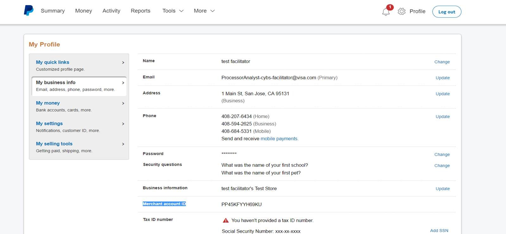

## Merchant's PayPal account information

The below details are required for configuring PayPal sandbox details in the CyberSource test environment:
**paypalgateway_client_key** & **paypalgateway_secret_phrase** – Paypal REST Client ID & Secret that merchant has to provide from their PayPal account.
- Login to PayPal account through developer login (sandbox login for CAS and production PayPal login for production)
- Click on My Apps -> go to 'My Apps & Credentials' -> scroll to the 'REST API apps' section -> Click on the 'Create App' button -> and follow through the process by providing a name and choosing the correct Sandbox developer account. Please see illustrations below.
- If merchant has not created an App already, they should create it
- Click on the created App to retrieve the associated Client ID and Secret.

**paypalgateway_merchant_email** – PayPal “facilitator” account from the merchant
**paypalgateway_mid** - Merchant needs to find the MID from PayPal account as below:
1.	Login to PayPal account (sandbox or production) using facilitator account username and password
2.	Click on ‘profile and setting’ in the top right corner
3.	Navigate to the ‘My business info’ from the left navigation panel
4.	Merchant should see ‘Merchant account ID’ on that page. Please see screen shot below.

